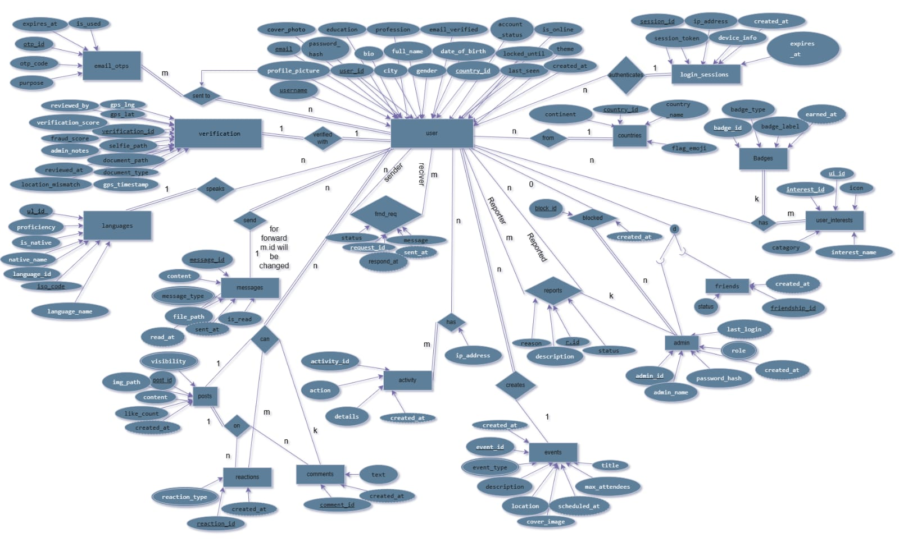
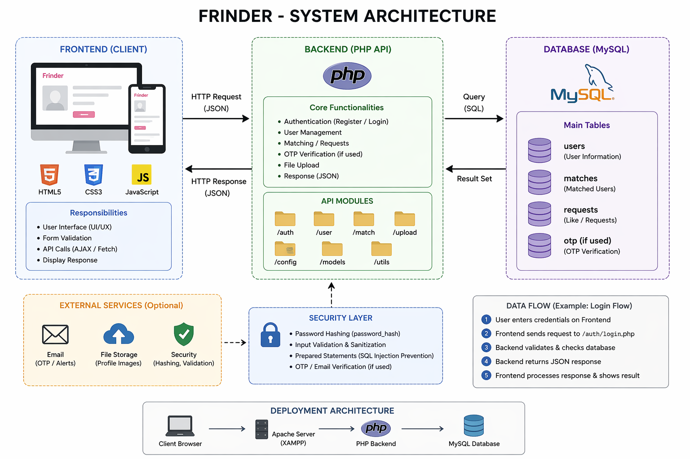

# 🌍 FRINDER — Verified Global Friendship Platform
> Pure Friendship. No Borders. No Limits.

A complete full-stack DBMS project: **23 MySQL tables · 35+ PHP REST APIs · React 18 Frontend**

---

## 🚀 Quick Setup (6 Steps)

### Prerequisites
- [XAMPP](https://www.apachefriends.org) (PHP 8.1+, MySQL 8.0+)
- [Node.js](https://nodejs.org) v20+ (LTS)

---

### STEP 1 — Start XAMPP
1. Open **XAMPP Control Panel**
2. Click **Start** next to **Apache**
3. Click **Start** next to **MySQL**
4. Visit `http://localhost` — you should see the XAMPP welcome page ✓

---

### STEP 2 — Import the Database
1. Open `http://localhost/phpmyadmin`
2. Click **New** in the left sidebar
3. Name it `frinder` → click **Create**
4. Click the `frinder` database → click **Import** tab
5. Click **Choose File** → select `database/frinder.sql`
6. Click **Go**
7. ✅ All 23 tables created with sample data

---

### STEP 3 — Copy Backend to XAMPP
Copy the entire project folder to your XAMPP htdocs:

**Windows:**
```
C:\xampp\htdocs\frinder\
```

**Mac/Linux:**
```
/Applications/XAMPP/htdocs/frinder/
  OR
/opt/lampp/htdocs/frinder/
```

Your backend should be at: `http://localhost/frinder/backend/`

Test it: `http://localhost/frinder/backend/lookup.php?action=all`
You should see JSON with countries/interests/languages ✓

---

### STEP 4 — Configure Email (Optional but Recommended)
Edit `backend/config/mail.php`:

```php
define('SMTP_USER', 'your@gmail.com');
define('SMTP_PASS', 'your-16-char-app-password');
```

**To get Gmail App Password:**
1. Google Account → Security → 2-Step Verification → App Passwords
2. Generate new password for "Mail"
3. Use the 16-character code

**⚠️ Without email configured:**
- OTP codes are logged to Apache error log
- Windows: `C:\xampp\apache\logs\error.log`
- Mac: `/Applications/XAMPP/logs/error.log`
- Search for `FRINDER OTP` to find the code

---

### STEP 5 — Install PHPMailer (Optional)
In the `frinder/` root folder:
```bash
composer require phpmailer/phpmailer
```
If you don't have Composer: skip this — OTPs will be logged to error.log instead.

---

### STEP 6 — Setup and Run Frontend
```bash
cd frinder/frontend
npm install
npm run dev
```

Open `http://localhost:7410` in your browser 🎉

---

## 📚 Documentation

- 📊 ER Diagram  
    

- 🧠 System Architecture  
   

- 📄 API Documentation  
  [View API Docs](docs/API_Documentation.md)

---

## 👨‍💻 Team

<p align="center">
  
</p>


---

## 🎮 Demo Accounts

| Account | Email | Password |
|---------|-------|----------|
| Alex Chen (JP) | alex@demo.com | Demo@1234 |
| Sofia Rivera (IN) | sofia@demo.com | Demo@1234 |
| James Okafor (NG) | james@demo.com | Demo@1234 |
| **Admin** | admin@frinder.com | password |

**Admin Panel:** `http://localhost:7410/admin`

---

## 📁 Project Structure

```
frinder/
│
├── 📄 SETUP_GUIDE.txt
│       └── Step by step setup instructions for running the project
│
├── 📄 README.md
│       └── Basic project description
│
│
├── 📁 backend/                          ← ALL PHP SERVER CODE
│   │
│   ├── 📄 .htaccess
│   │       └── Apache security rules + CORS headers for backend folder
│   │
│   ├── 📄 setup_admin.php               ← RUN ONCE THEN DELETE
│   │       └── Sets FrinderV1 password for all 3 admins in database
│   │
│   ├── 📁 config/                       ← SHARED SETTINGS (used by every PHP file)
│   │   ├── 📄 db.php
│   │   │       └── Database connection — host, name, user, password
│   │   │           getDB() function — creates ONE connection and reuses it
│   │   │
│   │   ├── 📄 helpers.php
│   │   │       └── THE FOUNDATION — included at top of every PHP file
│   │   │           • CORS headers (allows React to talk to PHP)
│   │   │           • respond() — sends JSON back to React
│   │   │           • requireAuth() — verifies session token
│   │   │           • optionalAuth() — optional login check
│   │   │           • requireAdmin() — admin-only protection
│   │   │           • sendOTPEmail() — sends OTP via PHPMailer
│   │   │           • logActivity() — writes to user_activity table
│   │   │           • clean() — sanitizes text input (prevents XSS)
│   │   │           • timeAgo() — converts timestamp to "2h ago"
│   │   │
│   │   └── 📄 mail.php
│   │           └── Gmail SMTP settings for sending OTP emails
│   │               SMTP_HOST, SMTP_PORT, SMTP_USER, SMTP_PASS
│   │               ← Fill these with your Gmail App Password
│   │
│   ├── 📁 auth/                         ← LOGIN AND REGISTRATION
│   │   ├── 📄 register.php
│   │   │       └── Step 1 of registration
│   │   │           • Validates: username, email, password, age 13+
│   │   │           • Checks duplicate email and username
│   │   │           • Hashes password with bcrypt
│   │   │           • Creates row in users + user_verification tables
│   │   │
│   │   ├── 📄 login.php
│   │   │       └── Step 1 of login
│   │   │           • Finds user by email
│   │   │           • Verifies password with password_verify()
│   │   │           • Checks account lockout (5 wrong = 15 min lock)
│   │   │           • Generates OTP with random_int()
│   │   │           • Sends OTP email
│   │   │           • Returns user_id to frontend
│   │   │
│   │   ├── 📄 verify_otp.php
│   │   │       └── Step 2 of login
│   │   │           • Rate limits: max 5 wrong OTP per 15 min
│   │   │           • Finds matching unexpired OTP in database
│   │   │           • Marks OTP as used
│   │   │           • Creates 64-char session token
│   │   │           • Saves to login_sessions (24hr expiry)
│   │   │           • Returns token + user data to React
│   │   │
│   │   ├── 📄 send_otp.php
│   │   │       └── Resend OTP
│   │   │           • Invalidates old unused OTPs
│   │   │           • Generates new OTP
│   │   │           • Sends email again
│   │   │
│   │   ├── 📄 save_profile.php
│   │   │       └── Step 2 of registration (after email verify)
│   │   │           • Saves bio, education, profession
│   │   │           • Saves selected interests
│   │   │           • Saves selected languages
│   │   │           • Checks if score >= 80 → set status to pending
│   │   │
│   │   └── 📄 logout.php
│   │           └── • Deletes session from login_sessions table
│   │               • Sets user is_online = 0
│   │               • Logs the logout action
│   │
│   ├── 📁 users/                        ← USER PROFILES AND DISCOVERY
│   │   ├── 📄 get_profile.php
│   │   │       └── Returns complete profile data
│   │   │           • User info, interests, languages, badges
│   │   │           • Friend status with the viewer
│   │   │           • Recent posts (last 10)
│   │   │           • Stats: friend count, post count, countries connected
│   │   │           • Works for own profile AND other users
│   │   │
│   │   ├── 📄 update_profile.php
│   │   │       └── Edit your own profile
│   │   │           • Updates bio, city, education, profession
│   │   │           • Avatar upload (file or base64)
│   │   │           • Validates image with magic bytes (JPEG/PNG/WebP)
│   │   │           • Deletes old avatar from disk before saving new
│   │   │           • Updates interests and languages
│   │   │
│   │   ├── 📄 discover.php
│   │   │       └── Browse verified users (requires login)
│   │   │           • Calculates compatibility score for each user
│   │   │           • Excludes: yourself, friends, blocked users
│   │   │           • Filters: country, continent, age, language, interest
│   │   │           • Fully parameterized SQL (no injection)
│   │   │
│   │   └── 📄 public_discover.php
│   │           └── Same as discover but NO login required
│   │               For guests browsing before registering
│   │
│   ├── 📁 posts/                        ← FEED AND POSTS
│   │   └── 📄 posts.php
│   │           └── All post operations in one file:
│   │               GET  ?action=feed     → posts from friends + own + public
│   │                                       blocked users excluded
│   │               GET  ?action=comments → comments for a post
│   │               POST ?action=create   → create text or image post
│   │               POST ?action=like     → toggle like on/off
│   │               POST ?action=comment  → add comment
│   │               DELETE ?post_id=X     → delete post + image file
│   │
│   ├── 📁 friends/                      ← FRIEND SYSTEM
│   │   └── 📄 friends.php
│   │           └── All friendship operations:
│   │               GET  ?action=friends  → friends list
│   │               GET  ?action=received → incoming requests
│   │               GET  ?action=sent     → outgoing requests
│   │               POST ?action=send     → send friend request
│   │               POST ?action=accept   → accept request
│   │               POST ?action=decline  → decline request
│   │               POST ?action=cancel   → cancel sent request
│   │               POST ?action=unfriend → remove friend
│   │
│   ├── 📁 messages/                     ← CHAT SYSTEM
│   │   └── 📄 messages.php
│   │           └── All messaging operations:
│   │               GET  ?action=conversations → list of all chats
│   │                                            with last message + unread count
│   │               GET  ?action=chat          → full chat history with one user
│   │                                            marks messages as read
│   │               POST ?action=send          → send a new message
│   │
│   ├── 📁 events/                       ← EVENTS AND MEETUPS
│   │   └── 📄 events.php
│   │           └── GET  (no action) → list your events + invited events
│   │               POST ?action=create  → create event, invite friends
│   │               POST ?action=respond → accept or decline invitation
│   │
│   ├── 📁 safety/                       ← REPORTING AND BLOCKING
│   │   └── 📄 safety.php
│   │           └── POST ?action=report  → report a user
│   │                                      auto-suspends at 5 reports
│   │               POST ?action=block   → block user (removes friendship)
│   │               POST ?action=unblock → unblock user
│   │
│   ├── 📁 verification/                 ← IDENTITY VERIFICATION
│   │   └── 📄 upload.php
│   │           └── POST ?action=selfie   → upload selfie (+30 score)
│   │                                       saves to uploads/selfies/
│   │               POST ?action=document → upload ID/passport (+50 score)
│   │                                       saves to uploads/documents/
│   │               POST ?action=gps      → save GPS coordinates (+20 score)
│   │               If score >= 80 → account status → pending
│   │
│   ├── 📁 admin/                        ← ADMIN PANEL BACKEND
│   │   └── 📄 admin.php
│   │           └── POST ?action=login         → admin login (no OTP)
│   │               GET  ?action=analytics     → platform stats
│   │               GET  ?action=pending       → users awaiting approval
│   │               GET  ?action=users         → all users with search
│   │               GET  ?action=reports       → submitted reports
│   │               GET  ?action=fraud         → fraud flagged users
│   │               POST ?action=approve       → verify a user
│   │               POST ?action=reject        → reject a user
│   │               POST ?action=suspend       → suspend a user
│   │               POST ?action=resolve_report→ mark report resolved
│   │
│   └── 📄 lookup.php
│           └── Returns ALL dropdown data in one call:
│               • 180+ countries with flag emojis
│               • All interests with icons
│               • All languages with native names
│               Used by: Register form, Profile edit form
│
│
├── 📁 frontend/                         ← ALL REACT CODE
│   │
│   ├── 📄 index.html
│   │       └── Root HTML file
│   │           Loads Google Fonts (Space Grotesk, Inter)
│   │           Loads Leaflet CSS for maps
│   │           Has <div id="root"> where React mounts
│   │
│   ├── 📄 package.json
│   │       └── Project dependencies list
│   │           React, Axios, Framer Motion, React Router
│   │           React Leaflet, Tailwind, Vite
│   │
│   ├── 📄 vite.config.js                ← CRITICAL CONFIG FILE
│   │       └── Vite dev server settings
│   │           port: 7410 (change here to change URL port)
│   │           PROXY RULES:
│   │           /api/auth      → /frinder/backend/auth/
│   │           /api/users     → /frinder/backend/users/
│   │           /api/posts     → /frinder/backend/posts/
│   │           /api/friends   → /frinder/backend/friends/
│   │           /api/messages  → /frinder/backend/messages/
│   │           /api/events    → /frinder/backend/events/
│   │           /api/safety    → /frinder/backend/safety/
│   │           /api/admin     → /frinder/backend/admin/
│   │           /api/verification → /frinder/backend/verification/
│   │           /api/lookup.php  → /frinder/backend/
│   │           /api/uploads   → /frinder/uploads/ ← NOT backend!
│   │
│   ├── 📄 tailwind.config.js
│   │       └── Custom color palette
│   │           dark-500 = #070c18 (background)
│   │           primary-500 = #0066ff (blue)
│   │           All color class names defined here
│   │
│   ├── 📄 postcss.config.js
│   │       └── Required by Tailwind to process CSS
│   │
│   └── 📁 src/                          ← ALL REACT SOURCE CODE
│       │
│       ├── 📄 main.jsx
│       │       └── Entry point. Renders <App /> into index.html root div
│       │
│       ├── 📄 App.jsx                   ← ALL ROUTES DEFINED HERE
│       │       └── Defines every URL and which component it loads
│       │           Route guards:
│       │           ProtectedRoute    → needs frinder_token
│       │           GuestAllowedRoute → anyone can view
│       │           PublicRoute       → redirects logged-in users away
│       │           AdminRoute        → needs frinder_admin_token
│       │           Routes:
│       │           /           → Home.jsx
│       │           /login      → Login.jsx
│       │           /register   → Register.jsx
│       │           /dashboard  → Dashboard.jsx (protected)
│       │           /profile    → Profile.jsx (protected)
│       │           /profile/:id→ Profile.jsx (guest allowed)
│       │           /discover   → Discover.jsx (guest allowed)
│       │           /chat       → Chat.jsx (protected)
│       │           /chat/:id   → Chat.jsx (protected)
│       │           /friends    → Friends.jsx (protected)
│       │           /events     → Events.jsx (protected)
│       │           /map        → FriendMap.jsx (protected)
│       │           /admin      → AdminLogin.jsx
│       │           /admin/dashboard → AdminDashboard.jsx (admin)
│       │
│       ├── 📄 index.css
│       │       └── Global styles
│       │           Glass/glassmorphism CSS classes
│       │           Custom animations (shimmer, pulse, spin)
│       │           Scrollbar colors
│       │           Leaflet map dark theme override
│       │
│       ├── 📁 context/                  ← GLOBAL STATE
│       │   └── 📄 AuthContext.jsx
│       │           └── Global user state shared with entire app
│       │               Provides to every component:
│       │               • user       → logged in user object
│       │               • loading    → true while checking localStorage
│       │               • isGuest    → true if not logged in
│       │               • login()    → save token + user to localStorage
│       │               • logout()   → clear token + redirect
│       │               • updateUser()→ update user in state + storage
│       │               On page load: checks localStorage for token
│       │               Validates token length (must be 64 chars)
│       │
│       ├── 📁 services/                 ← ALL API CALLS
│       │   └── 📄 api.js
│       │           └── Central API file. All HTTP calls go here.
│       │               BASE = "/api" (Vite proxy handles conversion)
│       │               Request interceptor:
│       │               → adds Bearer token to EVERY request automatically
│       │               Response interceptor:
│       │               → catches 401 → clears storage → redirect /login
│       │               API groups:
│       │               authAPI    → register, login, verifyOTP, logout
│       │               lookupAPI  → countries, interests, languages
│       │               userAPI    → getProfile, updateProfile, discover
│       │               verifyAPI  → upload selfie/document/gps
│       │               friendAPI  → send, accept, decline, unfriend
│       │               messageAPI → conversations, chat, send
│       │               postAPI    → feed, create, like, comment, delete
│       │               eventAPI   → getAll, create, respond
│       │               safetyAPI  → report, block, unblock
│       │               adminAPI   → login, analytics, approve, reject
│       │               imgSrc()   → builds correct image URL
│       │
│       ├── 📁 components/               ← REUSABLE UI PIECES
│       │   │
│       │   ├── 📄 UI.jsx                ← COMPONENT LIBRARY
│       │   │       └── All reusable components in one file:
│       │   │           PageWrapper  → animated page container
│       │   │           Avatar       → profile picture with smart path
│       │   │                          selfies/ and posts/ folders handled
│       │   │                          falls back to initials if image fails
│       │   │           Btn          → button with loading spinner state
│       │   │           Card         → glass dark card container
│       │   │           Modal        → popup with backdrop + escape key
│       │   │           Input        → styled text input with label + icon
│       │   │           Textarea     → multiline input
│       │   │           Tag          → colored pill badge
│       │   │           StatusBadge  → Verified/Pending/Rejected badge
│       │   │           EmptyState   → empty list placeholder
│       │   │           Skeleton     → shimmer loading placeholder
│       │   │           OTPInput     → 6 boxes that auto-advance
│       │   │           useToast     → toast notification hook
│       │   │
│       │   ├── 📄 Navbar.jsx
│       │   │       └── Left sidebar navigation
│       │   │           All route links with icons
│       │   │           Highlights active current route
│       │   │           User avatar + name + online dot
│       │   │           Logout button at bottom
│       │   │           Collapses to icons on small screens
│       │   │
│       │   ├── 📄 PostCard.jsx
│       │   │       └── Single post display component
│       │   │           User avatar + name + country flag
│       │   │           Post text content
│       │   │           Post image (if any)
│       │   │           Like button with count toggle
│       │   │           Comments section (expand/collapse)
│       │   │           Delete button (own posts only)
│       │   │
│       │   ├── 📄 CreatePost.jsx
│       │   │       └── Create post modal
│       │   │           Text input + optional image upload
│       │   │           Friends-only or Public visibility
│       │   │           Image sent as FormData with Bearer token
│       │   │           Calls onCreated() with new post on success
│       │   │
│       │   ├── 📄 FriendCard.jsx
│       │   │       └── User suggestion card
│       │   │           Avatar, name, country, compatibility score
│       │   │           Interest tags preview
│       │   │           Add Friend / Request Sent button
│       │   │
│       │   ├── 📄 AuthPrompt.jsx
│       │   │       └── Modal for guest users
│       │   │           Shown when guest tries to interact
│       │   │           Has Login and Register buttons
│       │   │
│       │   └── 📄 GuestBanner.jsx
│       │           └── Top banner for non-logged-in users
│       │               Encourages signup
│       │
│       └── 📁 pages/                    ← FULL PAGE COMPONENTS
│           │
│           ├── 📄 Home.jsx
│           │       └── Landing page (everyone can see)
│           │           Hero section + Frinder logo
│           │           Platform stats (180+ countries etc)
│           │           Feature highlights
│           │           Register + Login buttons
│           │
│           ├── 📄 Register.jsx
│           │       └── 5-step registration wizard
│           │           Step 1: Basic info (name, email, password, DOB)
│           │           Step 2: Email OTP verification
│           │           Step 3: Profile (bio, interests, languages)
│           │           Step 4: Selfie capture (camera)
│           │           Step 5: Document upload (ID/passport)
│           │           Animated progress bar
│           │           Slide transitions between steps
│           │
│           ├── 📄 Login.jsx
│           │       └── Two-tab login page
│           │           Tab 1 — Login as User:
│           │               email + password + OTP 2FA
│           │               demo account quick-fill buttons
│           │               resend OTP timer
│           │           Tab 2 — Login as Admin:
│           │               email + password only (no OTP)
│           │               → redirects to /admin/dashboard
│           │
│           ├── 📄 Dashboard.jsx
│           │       └── Main home screen after login
│           │           Post feed (friends + public)
│           │           Friend suggestions with score
│           │           Pending requests preview
│           │
│           ├── 📄 Profile.jsx
│           │       └── User profile page
│           │           Own profile: edit + create post + change avatar
│           │           Other profile: add friend + message + report + block
│           │           Shows: bio, interests, languages, stats, posts
│           │           Cover photo with parallax
│           │           Verified checkmark badge
│           │
│           ├── 📄 Discover.jsx
│           │       └── Browse global verified users
│           │           Filter panel: country, continent, age, language, interest
│           │           Search by name, username, bio
│           │           Cards sorted by compatibility score
│           │           Pagination (20 per page)
│           │
│           ├── 📄 Friends.jsx
│           │       └── Three sections:
│           │           Friends list (with unfriend option)
│           │           Received requests (accept / decline)
│           │           Sent requests (cancel)
│           │
│           ├── 📄 Chat.jsx
│           │       └── Messaging interface
│           │           Conversation list (left panel)
│           │           Chat window (right panel)
│           │           Messages oldest to newest
│           │           Read receipts
│           │           Send on Enter or button
│           │           Unread count badge
│           │
│           ├── 📄 Events.jsx
│           │       └── Events list
│           │           Create event modal
│           │           Accept / Decline invitation
│           │           Attendee avatars
│           │           Countdown to event date
│           │
│           ├── 📄 FriendMap.jsx
│           │       └── Interactive Leaflet.js world map
│           │           Friend locations as map markers
│           │           Smart image path for avatars
│           │           Click marker → see friend details
│           │           Dark map theme
│           │
│           ├── 📄 AdminLogin.jsx
│           │       └── Admin login page at /admin
│           │           Email + password (no OTP)
│           │           Saves token to frinder_admin_token
│           │           Redirects to /admin/dashboard
│           │           Back to User Login link
│           │
│           └── 📄 AdminDashboard.jsx
│                   └── Admin control panel at /admin/dashboard
│                       Verifies admin token on load
│                       Redirects to /admin if invalid token
│                       Tabs:
│                       📊 Analytics   → user/post/message counts + top countries
│                       ⏳ Pending     → approve or reject verification queue
│                       👥 Users       → all users, search, suspend action
│                       🚩 Reports     → view and resolve reports
│                       🔍 Fraud       → high fraud score + location mismatch
│                       🌐 Go to App   → browse platform as normal user
│
│
├── 📁 uploads/                          ← USER UPLOADED FILES (served by Apache)
│   │
│   ├── 📄 .htaccess
│   │       └── Blocks PHP execution inside uploads folder
│   │           Security: uploaded files cannot run as scripts
│   │
│   ├── 📁 posts/
│   │   ├── 📄 .htaccess                 ← same PHP block security
│   │   └── 🖼️ avatar_1_xxx.jpg          ← profile pictures uploaded via update_profile.php
│   │       🖼️ post_1_xxx.jpg            ← post images uploaded via posts.php
│   │
│   ├── 📁 selfies/
│   │   ├── 📄 .htaccess
│   │   └── 🖼️ 1_selfie_xxx.jpg          ← verification selfies (stored as "selfies/filename")
│   │
│   └── 📁 documents/
│       ├── 📄 .htaccess
│       └── 📄 1_xxx_passport.jpg        ← identity documents (private, admin only)
│
│
└── 📁 database/
    └── 📄 frinder.sql                   ← EXPORT THIS FOR DATA SHARING
            └── Complete database schema + seed data
                23 tables — all CREATE TABLE statements
                8 default demo users
                Admin accounts
                Countries, interests, languages data
                ⚠️ Does NOT auto-update when you add data
                ⚠️ Must re-export from phpMyAdmin to include new users

---

## 🗄️ Database (23 Tables)

| # | Table | Purpose |
|---|-------|---------|
| 1 | users | All accounts, credentials, status |
| 2 | countries | 50 world countries lookup |
| 3 | languages | 25 languages lookup |
| 4 | interests | 30 interest categories |
| 5 | email_otps | OTP codes for register/login |
| 6 | user_verification | Selfie, document, GPS, scores |
| 7 | login_sessions | Active session tokens |
| 8 | user_interests | Users ↔ interests junction |
| 9 | user_languages | Users ↔ languages junction |
| 10 | friend_requests | All friendship requests |
| 11 | friends | Confirmed friendships |
| 12 | messages | Direct messages |
| 13 | posts | User posts (text/image) |
| 14 | post_likes | Post likes (unique per user) |
| 15 | post_comments | Post comments |
| 16 | events | Meetups, calls, groups |
| 17 | event_attendees | Event invitations |
| 18 | reports | Safety reports |
| 19 | blocked_users | Blocked user pairs |
| 20 | user_badges | Gamification badges |
| 21 | user_activity | Audit log |
| 22 | admin_users | Admin accounts |
| 23 | post_reaction | user can react anything on post |


---


## 🔐 Security Features

1. **bcrypt Password Hashing** — Never stored plain text
2. **2-Step OTP Login** — Email verification on every login
3. **PDO Prepared Statements** — SQL injection proof
4. **Bearer Token Auth** — 64-char hex session tokens
5. **Account Lockout** — 5 wrong passwords → 15 min lock
6. **Secure File Upload** — MIME validation, blocked directory
7. **CORS Protection** — Restricted to localhost:5173
8. **XSS Prevention** — htmlspecialchars on all output
9. **Fraud Detection** — Auto-flag after 5+ reports
10. **Admin Verification** — Separate admin session system

---

## 🔧 Troubleshooting

**"API not working" / CORS errors:**
- Make sure XAMPP Apache is running
- Backend must be at `http://localhost/frinder/backend/`
- Check `vite.config.js` proxy is set to `http://localhost`

**"OTP not received":**
- Check Apache error log for `FRINDER OTP` entries
- Configure `backend/config/mail.php` with real SMTP credentials

**"Upload failed":**
- Create `uploads/selfies/`, `uploads/documents/`, `uploads/posts/` folders
- Give write permissions: `chmod 755 uploads/` (Mac/Linux)

**"Database connection failed":**
- Ensure MySQL is running in XAMPP
- Default credentials: host=localhost, user=root, pass=''
- Edit `backend/config/db.php` if different

**"Images not showing":**
- Images are served from `/api/uploads/posts/`
- The Vite proxy maps `/api` → `http://localhost/frinder/backend`

---

## 📱 Features

- ✅ 6-step animated registration wizard
- ✅ 2-step OTP login (email verification)
- ✅ Government document upload
- ✅ Live selfie capture (webcam API)
- ✅ GPS location verification
- ✅ Global friend discovery with filters
- ✅ Compatibility scoring algorithm
- ✅ Real-time chat (2s polling)
- ✅ Post feed with likes & comments
- ✅ Events (meetup/call/group)
- ✅ Interactive friend world map
- ✅ Friend requests system
- ✅ Report & block users
- ✅ Friendship badges & milestones
- ✅ Admin dashboard with analytics
- ✅ Fully responsive (mobile, tablet, desktop)
- ✅ Dark blue theme with glass morphism
- ✅ Framer Motion page transitions

---

## 🛠️ Tech Stack

| Layer | Technology |
|-------|-----------|
| Frontend | React 18, Vite |
| Styling | Tailwind CSS 3 |
| Animations | Framer Motion |
| HTTP Client | Axios |
| Router | React Router v6 |
| Map | React Leaflet |
| Backend | PHP 8.1+ |
| Database | MySQL 8.0 |
| Email | PHPMailer + SMTP |
| Local Dev | XAMPP |


© 2025-26 Frinder · DBMS Project · Pure Friendship · No Borders · No Limits
=======


